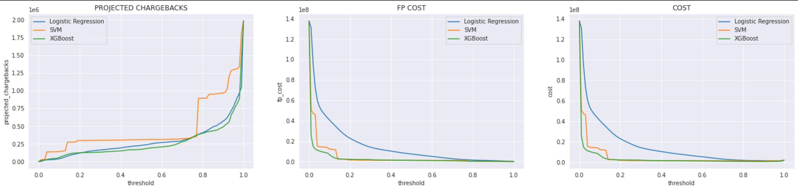
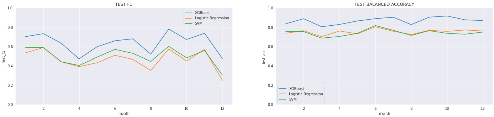

# GA Capstone : Credit Card Fraud detection

**Objective:**

The aim of the project is to identify fraudulent credit card transactions at the point of transaction. Therefore, only data up to the point of transaction can be used to prevent data leakage.

**Data Source:**

[Sparkov Data Generation, Synthetic credit card transactions](https://github.com/namebrandon/Sparkov_Data_Generation)

**Data Set:**

[Link to dataset hosted on google drive](https://drive.google.com/drive/folders/1QdtrHzm_R01-ZOZAqG-zWEfh0tymTF9i?usp=sharing)

**Project Outline:**

The project is separated into 3 notebooks:

 	1. Baseline Model
 	2. EDA
 	3. Final Model

**Baseline Model**

In this section, we ran 3 models , Dummy Classifier , Logistic Regression and XGBoost to see how the models will perform without hyperparameter tuning and any treatments done on the data. As expected, all 3 models performed poorly as there's a severe data imbalance (99.77% non-fraudulent and 0.23% fraudulent transactions).

**EDA**

This notebook is separated into 2 main segments. The first half deals with looking through all the features to see if there's any difference between fraudulent transactions and regular transactions. During our EDA we found that some features seems to stand out  and may be able to help with our classification.

**Some notable features:**

In each of the features shown below, we can see that fraudulent transactions has a different behaviour compared to regular transactions. We will go into more details in the notebook.

In the second half of the notebook, we created several features such as number of transactions made in the previous month, computing the distance between cardholder's address and the store. 

**Final Model**

Our entire data consist of synthetic credit card transaction data from 2012 to 2015. 

2012 to 2014 will be used as our training data, and 2015 will be used for testing purposes only. The training data is further split into train and validation where 2014 will be used as our validation set.

We will be training our model like how you would in a time series model. We will be using an expanding training window methodology to mimic an actual deployment scenario, where the test set is the different month of the year, and retraining our model with fixed parameters with more and more data.

**Model selection:**

Going back to the aim of our project, it is to identify fraudulent transactions and minimizing cost to the company. When it comes to flagging transactions as fraudulent or not, the company can take a more conservative stance by flagging more transactions as fraudulent, which will result in more false positives or taking a more lax approach which will result in more false negatives.

As both false positive and false negative is costly to the company, a monetary cost is assigned to each of these. We will be assuming a marginal cost of $100 for each false positive flagged, and also using the average of the observed fraudulent transactions between 2012 - 2014 (about $500) as the marginal cost of each false negative transaction. We also assume that the bank will be paying in full for the chargebacks from the fraudulent transactions.

With this in mind, we will be using those figures to search for the optimal threshold (Logistic regression 99%, SVM 94%, XGBoost 84%) for each of our models during our training phase.

After running our models on our test set, we have found that XGBoost out performed our other 2 models in almost every single month in 2015, with the highest number of chargebacks avoided (by correctly identifying fraudulent transactions) and also the lowest chargebacks (from false negatives). 

**Note:** 

Fluctuations in total actual cost from month to month is due to large fluctuations in total number of transactions, with varying transaction amounts. Our precision and recall for all 3 models are relatively stable through out the 12 months of 2015.

**Data Dictionary**

| Column Name             | Data type  | Description                                                                                               |
|-------------------------|------------|-----------------------------------------------------------------------------------------------------------|
| Address                 | Object     | Address of where the traps are laid                                                                       |
| Species                 | Object     | Species of Mosquitoes captured                                                                            |
| Latitude                | float64    | Latitude of trap location                                                                                 |
| Longitude               | float64    | Longitude of trap location                                                                                |
| NumMosquitos            | int64      | Total number of mosquitoes found in the sample. Number ranges from 1 to 50.                               |
| WnvPresent              | int64      | 1 represents West Nile Virus detected in sample.  0 represent West Nile Virus not detected in the sample. |
| Year                    | int64      | Year of when the entry was recorded. Takes up value 2007,2009,2011 and 2013.                              |
| Month                   | int64      | Month of when the entry was recorded. Ranges between 5 to 10.                                             |
| Week                    | int64      | Week of when the entry was recorded. Ranges between 22 to 41.                                             |
| Cluster                 | int64      | Which group the trap is clustered under. Ranges between 0 to 3.                                           |
| Tmax                    | float64    | Maximum recorded temperature of the day, recorded in Celcius.                                             |
| Tmin                    | float64    | Minimum recorded temperature of the day, recorded in Celcius.                                             |
| Tavg                    | float64    | Average temperature of the day (Tmax + Tmin)/2 , recorded in Celcius                                      |
| DewPoint                | float64    | Dew point of the day, recorded in Celcius.                                                                |
| PrecipTotal             | float64    | Total precipitation recorded in inches.                                                                   |
| AvgSpeed                | float64    | Average wind speed recorded for the day in miles per hours                                                |
| seconds_daylight        | float64    | Number of seconds between sun rise to sun set.                                                            |
| Tmax_pct                | float64    | Percentage change of Tmax compared to one day before.                                                     |
| Tmin_pct                | float64    | Percentage change of Tmin compared to one day before.                                                     |
| Tavg_pct                | float64    | Percentage change of Tavg compared to one day before.                                                     |
| DewPoint_pct            | float64    | Percentage change of DewPoint compared to one day before.                                                 |
| PrecipTotal_pct         | float64    | Percentage change of Total precipitation recorded compared to one day before.                             |
| AvgSpeed_pct            | float64    | Percentage change of wind speed compared to one day before.                                               |
| seconds_daylight_pct    | float64    | Percentage change in time from sun rise to sun set compared to the day before.                            |
| Tmax_MA                 | float64    | 7 days moving average of recorded maximum temperature in Celcius.                                         |
| Tmin_MA                 | float64    | 7 days moving average of recorded minimum temperature in Celcius.                                         |
| Tavg_MA                 | float64    | 7 days moving average of recorded average temperature in Celcius.                                         |
| DewPoint_MA             | float64    | 7 days moving average of recorded Dew point. Recorded in Celcius.                                         |
| PrecipTotal_MA          | float64    | 7 days moving average of recorded total precipitation.                                                    |
| AvgSpeed_MA             | float64    | 7 days moving average of recorded wind speeds.                                                            |
| seconds_daylight_MA     | float64    | 7 days moving average of length of time between sun rise and sun set  recorded in seconds.                |
| Tmax_pct_MA             | float64    | 7 days moving average of percentage change in maximum temperature.                                        |
| Tmin_pct_MA             | float64    | 7 days moving average of percentage change in minimum temperature.                                        |
| Tavg_pct_MA             | float64    | 7 days moving average of percentage change in average temperature.                                        |
| DewPoint_pct_MA         | float64    | 7 days moving average of percentage change in dew point.                                                  |
| PrecipTotal_pct_MA      | float64    | 7 days moving average of percentage change in total precipitation.                                        |
| AvgSpeed_pct_MA         | float64    | 7 days moving average of percentage change in average wind speed.                                         |
| seconds_daylight_pct_MA | float64    | 7 days moving average of percentage change in time between sun rise and sun set.                          |
| Precip_MA_lag           | float64    | Previous recorded 7 days moving average total precipitation at the trap.                                  |
| seconds_daylight_lag    | float64    | Previous recorded length of the day recorded at the trap.                                                 |
| RH                      | float64    | Relative humidity, computed from average temperature and dew point.                                       |
| Num_sample              | float64    | Number of samples of mosquitoes caught by the trap.                                                       |
| Total_mos               | int64      | Total number of mosquitoes caught by the trap.                                                            |
| Total_wnv               | int64      | Total number of samples tested positive for west nile virus  when the trap was checked.                   |
| MIR                     | float64    | Mosquito infection rate. (Number of West Nile Virus Positive samples)/(total specimens tested * 1000)     |
| Previous_mos            | float64    | Previous recorded total number of mosquitoes caught by the trap.                                          |
| Previous_mir            | float64    | Previous recorded mosquito infection rate.                                                                |
| Previous_num_sample     | float64    | Previous recorded number of tested samples.                                                               |
| Day                     | int64      | Day of the month when the entry was recorded.                                                             |

