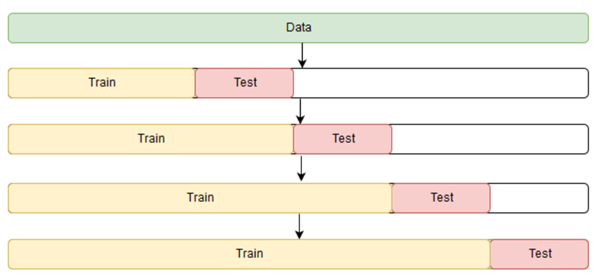

# GA Capstone : Credit Card Fraud detection

**Objective:**

The aim of the project is to identify fraudulent credit card transactions at the point of transaction. Therefore, only data up to the point of transaction can be used to prevent data leakage.

**Data Source:**

[Sparkov Data Generation, Synthetic credit card transactions](https://github.com/namebrandon/Sparkov_Data_Generation)

**Project Outline:**

The project is separated into 3 notebooks:

 	1. Baseline Model
 	2. EDA
 	1. Final Model

**Baseline Model**

In this section, we ran 3 models , Dummy Classifier , Logistic Regression and XGBoost to see how the models will perform without hyperparameter tuning and any treatments done on the data. As expected, all 3 models performed poorly as there's a severe data imbalance (99.77% non-fraudulent and 0.23% fraudulent transactions).

**EDA**

This notebook is separated into 2 main segments. The first half deals with looking through all the features to see if there's any difference between fraudulent transactions and regular transactions. During our EDA we found that some features seems to stand out  and may be able to help with our classification.

**Some notable features:**

In each of the features shown below, we can see that fraudulent transactions has a different behaviour compared to regular transactions. We will go into more details in the notebook.

In the second half of the notebook, we created several features such as number of transactions made in the previous month, computing the distance between cardholder's address and the store. 

**Final Model**

Our entire data consist of synthetic credit card transaction data from 2012 to 2015. 

2012 to 2014 will be used as our training data, and 2015 will be used for testing purposes only. The training data is further split into train and validation where 2014 will be used as our validation set.

We will be training our model like how you would in a time series model. We will be using an expanding training window methodology to mimic an actual deployment scenario, where the test set is the different month of the year, and retraining our model with fixed parameters with more and more data.

**Model selection:**

Going back to the aim of our project, it is to identify fraudulent transactions and minimizing cost to the company. When it comes to flagging transactions as fraudulent or not, the company can take a more conservative stance by flagging more transactions as fraudulent, which will result in more false positives or taking a more lax approach which will result in more false negatives.

As both false positive and false negative is costly to the company, a monetary cost is assigned to each of these. We will be assuming a marginal cost of $100 for each false positive flagged, and also using the average of the observed fraudulent transactions between 2012 - 2014 (about $500) as the marginal cost of each false negative transaction. We also assume that the bank will be paying in full for the chargebacks from the fraudulent transactions.

With this in mind, we will be using those figures to search for the optimal threshold (Logistic regression 99%, SVM 94%, XGBoost 84%) for each of our models during our training phase.

After running our models on our test set, we have found that XGBoost out performed our other 2 models in almost every single month in 2015, with the highest number of chargebacks avoided (by correctly identifying fraudulent transactions) and also the lowest chargebacks (from false negatives). 

**Note:** 

Fluctuations in total actual cost from month to month is due to large fluctuations in total number of transactions, with varying transaction amounts. Our precision and recall for all 3 models are relatively stable through out the 12 months of 2015.

**Data Dictionary**

